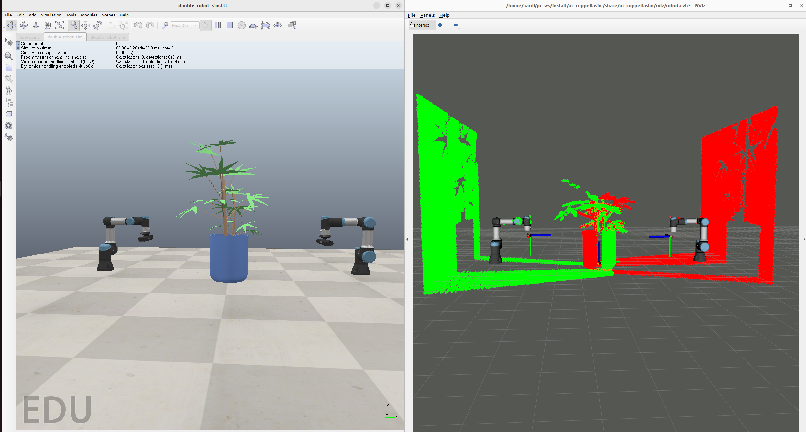

# Multi-Robot Cooperation in ROS2 with CoppeliaSim
  

This repository provides a ROS2 package, ur_coppeliasim, that implements an hardware interface of a Universal Robot using ROS2 controllers in CoppeliaSim with the possibility of spawning multiple robots in the same scene.



## Installation

### Setup
- Ubuntu 22.04
- [ROS2 Humble](https://docs.ros.org/en/humble/index.html)


### Prerequisites
#### 1. Install required packages:
```
sudo apt-get install xsltproc ros-humble-ros2-control ros-humble-ros2-controllers ros-humble-hardware-interface
```  
```  
python3 -m pip install pyzmq cbor xmlschema
```  
#### 2. Install CoppeliaSim Edu:
- Download CoppeliaSim Edu from the [website](https://www.coppeliarobotics.com/downloads);
- Extract the downloaded folder in $HOME and rename it:
```
tar -xf ~/Downloads/CoppeliaSim_Edu*
mv ~/CoppeliaSim_Edu* ~/CoppeliaSim
```
#### 3. If you do not have one already set up, create a new ROS2 workspace (named ros2_ws):
```
mkdir -p ~/ros2_ws/src
```
#### 4. Clone this repo in your workspace src folder:  
```
cd ~/ros2_ws/src
git clone https://github.com/Hydran00/Universal_Robot_ROS2_CoppeliaSim.git ur_coppeliasim
```
#### 5. Build workspace:  
```
cd $HOME/ros2_ws/
colcon build
```

#### 6. Add required ROS2 message in CoppeliaSim:  
CoppeliaSim has a ros2 workspace internally, which is used by CoppeliaSim to build the required ROS2 messages. In this workspace we define the ROS2 messages we need:
  - Go to your CoppeliaSim folder and find the meta folder of the ros2 interface:
  ```
  cd ~/CoppeliaSim/programming/ros2_packages/sim_ros2_interface/meta
  ```
  - Append required message definition to the file called ``interfaces.txt``:    
```
geometry_msgs/msg/PoseStamped
geometry_msgs/msg/Wrench  
geometry_msgs/msg/WrenchStamped  
std_msgs/msg/MultiArrayDimension  
std_msgs/msg/MultiArrayLayout 
std_msgs/msg/Float64MultiArray  
sensor_msgs/msg/JointState  
rosgraph_msgs/msg/Clock
``` 
- Alternatively, both steps can be obtained also with:
```
echo $'geometry_msgs/msg/PoseStamped\ngeometry_msgs/msg/Wrench\ngeometry_msgs/msg/WrenchStamped\nstd_msgs/msg/MultiArrayDimension\nstd_msgs/msg/MultiArrayLayout\nstd_msgs/msg/Float64MultiArray\nsensor_msgs/msg/JointState\nrosgraph_msgs/msg/Clock' >> ~/CoppeliaSim/programming/ros2_packages/sim_ros2_interface/meta/interfaces.txt
```
#### 7. Build CoppeliaSim workspace
  - To build the Coppelia ros2 workspace we define the ``COPPELIASIM_ROOT_DIR`` environment variable:  
```
export COPPELIASIM_ROOT_DIR=~/CoppeliaSim 
cd ~/CoppeliaSim/programming/ros2_packages/sim_ros2_interface/ 
colcon build --symlink-install
```
  If you are encountering compilation errors you can try with this command:
```
VERBOSE=1 MAKEFLAGS=-j1 colcon build --symlink-install --event-handlers console_direct+ --parallel-workers 1
```

#### 8. (Optional) Install controller
We provide the functionalities of the simulator along with a [package](https://github.com/fzi-forschungszentrum-informatik/cartesian_controllers/tree/ros2) which provides several Cartesian controllers. As this package will not be modified later on, we recommend to create another workspace for controllers in order to compile them just once. Alteratively, it can be compiled in the same workspace as before.
- Create a new workspace:
```
mkdir -p ~/controller_ws/src
```
- Clone the repo and install dependencies:
``` 
cd ~/controller_ws/src
git clone -b ros2 https://github.com/fzi-forschungszentrum-informatik/cartesian_controllers.git
rosdep install --from-paths ./ --ignore-src -y
```
- Download the following file required by the package compilation (we will not use this version of MuJoCo but the one included in CoppeliaSim, but in this way we prevent errors during the build):
``` 
cd; wget https://github.com/deepmind/mujoco/releases/download/2.1.1/mujoco-2.1.1-linux-x86_64.tar.gz
tar -xf mujoco-2.1.1-linux-x86_64.tar.gz
```
- Compile the controllers:
```
cd ~/controller_ws/
colcon build --cmake-args -DCMAKE_BUILD_TYPE=Release
```

## Running the simulation  
*For this demo, we assume you followed point 8.*  
#### 0. Source terminals
Remember to always source both the controller_ws and ros2_ws workspaces:
```
source $HOME/ros2_ws/install/setup.bash
source $HOME/controller_ws/install/setup.bash
```
You can automate this procedure copying these two lines in the .bashrc so that they are executed as soon as you start a terminal. This can be done with:
```
echo $'source $HOME/ros2_ws/install/setup.bash  \nsource $HOME/controller_ws/install/setup.bash' >> $HOME/.bashrc
```

#### 1. Load the world
Open CoppeliaSim
```
cd ~/CoppeliaSim/
./coppeliaSim.sh
```
and load ``double_robot.ttt`` which is under ``~/ros2_ws/src/ur_coppeliasim`` through ``File->Open_Scene``, then click the play button.

#### 2. Run the hardware interface + cartesian motion controller:
```
ros2 launch ur_coppeliasim ur_coppelia_controllers.launch.py
```
An RViz window will display the robot model along with an interactive marker at the end-effector, which allows us to change the end-effector target frame by drag-and-drop. Then, the controller will automatically compute the desired joint position, which will be sent to the simulator.

https://github.com/Hydran00/Universal_Robot_ROS2_CoppeliaSim/assets/93198865/1d3cc959-f36b-4224-923e-2f09fcd0596e

### 3. Multi-robot collaboration with stereo-cameras
If everything works you can setup the multi-robot version of the simulation.
You need to put [this](git@github.com:Hydran00/pc2-coppeliasim-ROS2.git) under ros2_ws/src and build the workspace again.

```
cd ~/ros2_ws/src
git clone https://github.com/Hydran00/pc2-coppeliasim-ROS2.git
cd ..
colcon build && source install/setup.bash
```
That package provides a C++ executables that convert the raw depth data into a PointCloud2 message.

Then, you can run the multi-robot version of the simulation:

```
ros2 launch ur_coppeliasim multi_robot.launch.py
```

